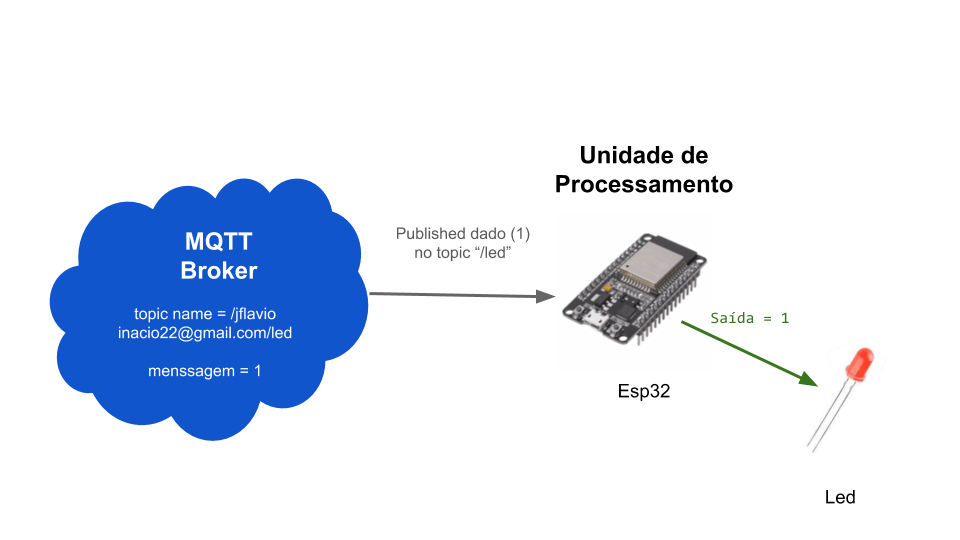

 

	
  &logo=<LOGO>">
  
  
  
  
  
  
  

<h1 align="center">
    
</h1>

<h4 align="center"> 
	🚧 Concluído  🚧
</h4>

 <a href="#-sobre-o-projeto">Sobre</a> •
 <a href="#-funcionalidades">Funcionalidades</a> •
 <a href="#-como-executar-o-projeto">Como executar</a> • 
 <a href="#-tecnologias">Tecnologias</a> • 
 <a href="#-autor">Autor</a> • 
 <a href="#user-content--licença">Licença</a>

## 💻 Sobre o projeto

Utilizando o Esp32 em conjunto com o protocolo de comunicação MQTT a fim de fazer um sistema de liga e desliga.
[Video do projeto](https://www.youtube.com/watch?v=nQ8GWy7Zifo) funcionando no Youtube   
  

---

## ⚙️ Funcionalidades

- [x] Controle do estado do led através do Mqtt:

---

## 🚀 Como executar o projeto

Este projeto é divido em três partes:
1. Esp32(Client)
2. Mqtt Explorer

💡O Esp32 utilizado: DOIT ESP32 DEVKIT V1

### Pré-requisitos

Antes de começar, você vai precisar ter instalado em sua máquina a seguinte ferramenta:
[MQTT Explorer](http://mqtt-explorer.com/). 
Além disto é bom ter um editor para trabalhar com o código como [Arduino IDE](https://www.arduino.cc/en/main/software)

#### 🧭 Executando o projeto

1. Clone este repositório  
`$ git clone git@github.com:FlavioInacio-jf/README-mqtt-e-esp32.git`

2. Acesse a pasta do projeto no seu terminal/cmd  
`$ cd README-mqtt-e-esp32`

3. Vá para a pasta do projeto e abra do arquivo code_esp32 utilizando o Arduino IDE

4. Siga os passos do [site](https://blog.eletrogate.com/conhecendo-o-esp32-usando-arduino-ide-2/#:~:text=Clique%20em%20Ferramentas%20%2F%20Placas%20%2F%20Gerenciador,para%20o%20pacote%20ficar%20ativo.) e instale a bliblioteca do esp32 

5. Crie seu próprio Broker Cloud utlizando o site [DIoTY](http://www.dioty.co/)

6. Altere os seguintes trechos no código com as informações fornecidas pelo [DIoTY](http://www.dioty.co/)  
~~~
Dados do Wifi
const char* ssid = "<informar o ssid do wifi>";
const char* password =  "<senha do wifi>";

/*Dados do Broker */
const int mqttPort = <Broker port>;
const char* mqttUser = "<User id>";
const char* mqttPassword = "<Password>";
const char* mqttServer = "Broker host";

const char* subscribe_topic_led = "<Your root topic>/led";
~~~
  
7. Conecte o Esp32 ao computador e compile o código

8. Verifique na serial do Arduino IDE se toda a conexão foi realizada corretamente

## 🛠 Tecnologias

As seguintes ferramentas foram usadas na construção do projeto:

#### **ESP32**  ([Arduino](https://www.arduino.cc/reference/pt/))

-  

#### **Utilitários**

-   Editor:  **[Arduino IDE](https://www.arduino.cc/en/main/software)**
-   Serve:  **[MQTT Explorer](http://mqtt-explorer.com/)**
-   Wifi:  **[WiFi](https://www.arduino.cc/en/Reference/WiFi)**
-   Client:  **[PubSubClient](https://github.com/knolleary/pubsubclient)**

---
## 💪 Como contribuir para o projeto

1. Faça um **fork** do projeto.
2. Crie uma nova branch com as suas alterações: `git checkout -b my-feature`
3. Salve as alterações e crie uma mensagem de commit contando o que você fez: `git commit -m "feature: My new feature"`
4. Envie as suas alterações: `git push origin my-feature`

---

## 🦸 Autor
 
  
 <b>Flávio Inácio</b>
  

 

---

## 📝 Licença

Este projeto esta sobe a licença [MIT](./LICENSE).

Feit por Flávio Inácio 👋🏽 [Entre em contato!](https://www.linkedin.com/in/fl%C3%A1vio-in%C3%A1cio/)

